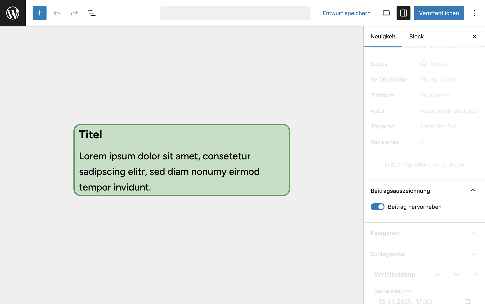
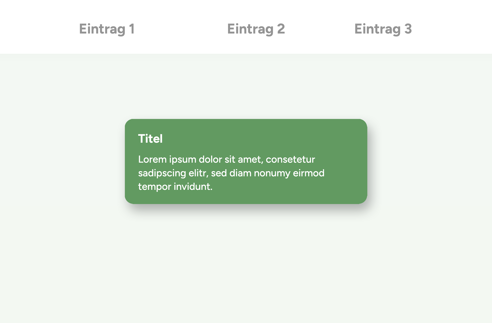

# Beitragsauszeichnung (WordPress Plugin)

Dieses Plugin ermöglicht es, Beiträge oder Blöcke im Editor und im Frontend visuell hervorzuheben. Ideal für Hinweise, wichtige Beiträge oder visuelle Gruppierungen im Layout.
Die Farben basieren auf Theme-Variablen (z. B. --wp--preset--color--highlight-500) und haben Fallbacks, falls keine Theme-Farben definiert sind.

## Funktionen

- Visuelle Hervorhebung durch die CSS-Klasse `is-highlighted`
- Einheitliche Gestaltung im Editor (`editor.css`) und im Frontend (`frontend.css`)
- Integration in Gutenberg-kompatible Themes
- Fallback-Farben für Kompatibilität ohne Block-Themes

## Anwendung

Füge im Block-Editor eine benutzerdefinierte CSS-Klasse `is-highlighted` zu einem Beitrag oder Block hinzu.  
Das Plugin sorgt automatisch für die passende Darstellung im Editor und auf der Website.

## Vorschau

### Im Editor

  
*Abbildung: Hervorgehobener Block mit der Klasse `is-highlighted` im Gutenberg-Editor.*

### Im Frontend

  
*Abbildung: Darstellung der Hervorhebung im Frontend mit aktiven Theme-Variablen.*

## CSS-Auszug

```css
background-color: var(--wp--preset--color--highlight-100, #CCE2CF);
border-color: var(--wp--preset--color--highlight-500, #4C9C5A);
```

## Installation

1. Plugin in den Ordner wp-content/plugins/ kopieren
2. Plugin im WordPress-Backend aktivieren
3. Optionale CSS-Klasse is-highlighted in einem Beitrag oder Block verwenden


<br><br><br><br><br>
# Kurze Entwickleranleitung

Kurzanleitung zur lokalen Weiterentwicklung des Plugins.

## 1. Projekt einrichten

Lade das Plugin herunter:
Auf „Code → Download ZIP“ klicken und das Plugin entpacken.

## 2. WordPress (Docker) starten

Nutze wp-env für eine lokale WordPress-Umgebung.
Öffne ein Terminal (macOS, Linux) oder PowerShell / Git Bash (Windows):
```bash
npx @wordpress/env start
```
Das Plugin liegt dabei in wp-content/plugins/.

## 3. Abhängigkeiten installieren und entwickeln
```bash
cd /pfad/zu/deinem/plugin  #navigiere zu deinem Plugin.
npm install                #lädt benötigte Node-Modules
npm start                  # startet den Watch-Modus für /src
```
Änderungen in src/ werden automatisch nach build/ geschrieben.

## 4. Build für Live-Einsatz
```bash
npm run build
```
Erzeugt einen optimierten, produktionsfertigen Build im Ordner build/.

## 5. Welche Dateien werden benötigt?

Für den produktiven Einsatz im WordPress-Plugin-Verzeichnis werden nur die folgenden Bestandteile benötigt:

- `build/` (vom Build-Prozess generiert)
- `block.json`
- PHP-Dateien (z. B. `plugin.php`, `render.php`, etc.)
- CSS-Dateien (z. B. `style.css`, `editor.css`)
- Optional: `assets/` (z. B. für Bilder oder Icons)

Nicht erforderlich (und typischerweise ausgeschlossen):

- `node_modules/`
- `src/`
- `.git/`
- `.gitignore`
- `package.json`, `package-lock.json`
- `.editorconfig`, `.eslintrc.js` usw.


